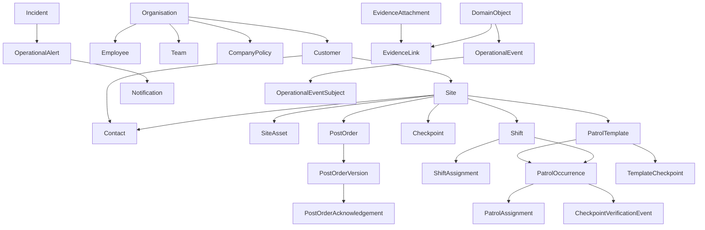

# Patrol Pro canonical domain model

**Status:** Phase 1 architecture contract

**Scope:** Persistence and internal domain ownership only
**Compatibility:** Existing supported APIs remain available unless explicitly noted

This document is authoritative for domain ownership. A model may be changed only by its owning service or through a documented cross-aggregate interface.

## Aggregate map

## Aggregate roots and owning services

| Aggregate root | Owned models | Canonical service |
|---|---|---|
| Organisation | Organisation, Company Policy, qualification catalogue | `organisations`, `company_policies`, `workforce_credentials` |
| Customer | Customer and customer Contacts | `customers`, `contacts` |
| Site | Site, site Contacts, Site Assets, Checkpoints and Post Orders | `sites`, `contacts`, `post_orders` |
| Employee | Employee, employee qualifications, Licences, Availability and Leave | `employees`, `workforce_credentials`, `workforce_scheduling` |
| Team | Team and membership | `teams` |
| Shift | Shift and Shift Assignments | `shifts` |
| Patrol Template | Template and ordered Template Checkpoints | `patrol_templates` |
| Patrol Occurrence | Occurrence, Patrol Assignments and Checkpoint Verification Events | `patrol_occurrences`, `checkpoint_verifications` |
| Incident | Incident | `incidents` |
| Operational Alert | Alert acknowledgement/resolution | `operational_alerts` |
| Notification | Delivery event | `notifications` |
| Evidence | Attachment and links | `evidence` |
| Daily Activity Report | Immutable report revisions | `daily_activity_reports` |
| Operational Event | Append-only event and subject links | `operational_events` |

## Model contract

| Model | Purpose and relationships | Lifecycle, deletion and retention | Permission, audit and API ownership |
|---|---|---|---|
| Organisation | Tenant root for every record. | Active, suspended or archived. Never cascade-delete operational history. | Company permission; all changes audited; organisation service. |
| Customer | Commercial account owning Sites and customer Contacts. | Active, inactive, archived; soft deletion. | `customers.view/manage`; customer service and `/customers`. |
| Site | Operational location belonging to exactly one Customer. | Draft, active, inactive, archived; referenced sites retained. | Site service; API remains internal until the site workflow is complete. |
| Contact | Structured customer or site contact with exactly one owner. | Effective-dated and soft-deleted. | Owning Customer/Site permissions; contact service; internal API. |
| Site Asset | Site equipment or infrastructure, optionally nested under another asset. | Active, inactive, retired; referenced assets retained. | Site permissions; site service; internal API. |
| Company Policy | Versioned organisation operational defaults. | Draft, approved, active, superseded, archived. Active versions immutable. | Company management; policy service; internal API. |
| Employee | Workforce identity optionally linked one-to-one with a login User. | Pending, active, inactive, archived; history retained. | Workforce permissions; employee service; `/users/officers` compatibility. |
| Team | Operational group of Employees. | Active, inactive, archived; membership history retained. | Team/user permissions; team service and `/teams`. |
| Qualification | Organisation credential definition. | Active or retired; no deletion while referenced. | Workforce credential service; internal API. |
| Employee Qualification | Employee award of a qualification. | Valid, expired, revoked; append corrections. | Workforce credential service; internal API. |
| Licence | Issued Employee credential. | Pending, valid, expired, revoked; retained. | Workforce credential service; internal API. |
| Availability | Employee availability declaration, not deployment history. | Proposed, confirmed, cancelled, expired. | Workforce scheduling service; internal API. |
| Leave | Employee absence and decision record. | Requested, approved, rejected, cancelled. Decisions retained. | Workforce scheduling service; internal API. |
| Shift | Site work window independent from patrol ownership. | Draft, published, active, completed, cancelled, archived. Terminal records immutable. | Shift service; internal API in Phase 1. |
| Shift Assignment | Employee or Team assignment to one Shift. | Proposed, confirmed, active, completed or cancelled. | Shift service only; internal API. |
| Patrol Template | Versioned reusable route, staffing and instructions. | Draft, active, retired/superseded. Active versions immutable. | Patrol management; template service; internal API. |
| Patrol Occurrence | Scheduled execution with immutable template snapshot and optional Shift. | Draft, scheduled, in progress, completed, missed, cancelled, archived. Terminal records immutable. | Existing patrol permissions; patrol service and `/patrols`. |
| Patrol Assignment | Employee or Team responsibility for an occurrence. | Current compatibility table references Users/Teams; canonical migration is additive. | Patrol occurrence service; `/patrols` compatibility. |
| Checkpoint | Permanent Site location, optionally used by templates. | Active, inactive, archived; never stores authoritative event history. | Checkpoint permissions; checkpoint service and `/checkpoints`. |
| Checkpoint Verification Event | Append-only confirmation attempt referencing checkpoint, occurrence, Employee and Shift. | Never overwritten or deleted during normal operation. | `checkpoints.verify/view`; verification service; existing verify endpoint. |
| Incident | Authoritative operational incident; current rich `alerts` table is retained physically for compatibility. | Open, investigating, resolved, cancelled. Terminal facts immutable. | Incident permissions; incident service; `/alerts` compatibility. |
| Operational Alert | Actionable signal from an Incident or monitoring rule. | Open, acknowledged, resolved, expired. | Operations permissions; internal alert service/API. |
| Notification | Delivery event for a source Domain Object. | Queued, sent, delivered, failed, read. Attempts retained. | Notification permissions and `/notifications`. |
| Evidence Attachment | Immutable storage metadata for any supported Domain Object. | Pending, available, quarantined, failed, retained/superseded. | Inherits parent access; evidence service; no public upload API in Phase 1. |
| Evidence Link | Tenant-validated link from Evidence to the shared registry. | Link removal does not delete evidence. | Evidence service only. |
| Daily Activity Report | Immutable revisioned operational report definition. | Draft, generated, approved, delivered, superseded. | Report permissions; internal model/service only. |
| Operational Event | Append-only business event stored in the extended `audit_logs` table. | Never updated or deleted; corrections reference the original. | Internal event service; audit compatibility read API. |
| Domain Object | Shared identity registry for all polymorphic references. | Created with its object; retired but not reused. | Registry service only; no public API. |

## State and immutability rules

Legal state edges are defined in `backend/app/domain/states.py`. Route handlers and feature services must call those definitions; they may not implement alternate transition graphs. Terminal operational states reject mutation and require correction, amendment, revision or supersession.

## Compatibility decisions

- The `patrols` table and `/patrols` API represent Patrol Occurrences.
- The rich `alerts` table remains the physical canonical Incident store during Phase 1; `/alerts` remains compatible.
- The minimal legacy `incidents` table is retained without accepting new canonical responsibility.
- Existing checkpoint `verified_*` columns remain compatibility projections; verification events are authoritative.
- User IDs remain in existing team and patrol assignment tables. New workforce models reference Employees; later workflow migration can replace compatibility columns safely.
- Existing `audit_logs` becomes the Operational Event Store by additive extension, avoiding duplicate history.

## Shared Domain Object Registry

All generic relationships use `domain_objects.id`. The registry stores the closed object type, local object ID, organisation, aggregate root and owning service. It is not a user-editable resource. Evidence, Operational Events and Notifications validate their registry reference and organisation before writing.

## Retention baseline

Operational occurrences, incidents, verification events, report revisions, acknowledgements, evidence metadata and operational events are retained according to organisation policy and applicable law. Phase 1 does not implement automated retention deletion. No operational history is cascade-deleted.
